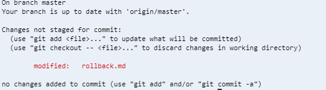

# GitHub Tutorial

by Habiba Khedr

---
## Git vs. GitHub

| Git | Github |
| --- | --- |
| Enables you to work on and keep track of your code | It is web-based |
| It is a Version Control System which keeps a snapshot of your work  | It stores your information in cloud |
| It doesn't require Github | Allows you to easily work with others |
|  | Tracks your changes |

   

---
## Initial Setup
To make a Github account follow the steps below:
1. Go to [https://github.com/]( https://github.com/)
2. On the top right corner you will see a "sign Up" button. Click on it
3. Now you will see a page  that says "create your account".
4. Type in your username (if you are a HSTAT student use school email)
5. Type in password
6. Verify account by solving a quick puzzle.
7. Click the blue button on the bottom of the page to continue
8. Choose your plan
9. Then answer the 3 questions provided (or you can skip this step)
10. After done answering the questions click the button that says "Complete setup"
11. Verify your email address
12. Great now you have a GitHub account.

Now to set up your ide follow the steps below :
1. Start out with going to [ide.cs50.io](ide.cs50.io)
2. Login with your GitHub account
3. Then go to this link and follow every step [https://github.com/hstatsep/ide50](https://github.com/hstatsep/ide50)
4. Now you have your ide set up for you.

As you were setting up your ide you set up an SSH Key between your ide and Github which is really important for you to have. When working with a GitHub repository, you'll often need to identify yourself to GitHub using your username and password. An SSH key is an efficient way to identify yourself that doesn't require you to enter your username and password every time.

---
## Repository Setup
After setting up both your ide and GitHub account you can go on and start creating repositories.
1. Choose or make a directory.
2. Now to initialize git you need to type `git init` and the directory will turn into a repository.
3. Make a new file by typing in `touch "filename"`in the command line.
4. Now type `c9 "filename"` to open your file.
5. Try editing inside the file.
6. After done editing go back to the command line and type `git add .`
7. Then type `git commit -m "short message`. The message that you should type in should be short and in present tense.It would also be good if you write what you have changed at that moment.
8. As you keep editing your file don't forget to add and commit.
9. You should also get in the habit of using git status a lot as you are coding and making changes to keep track of what you are doing.

---
## Workflow & Commands
The commands below are all typed in the command line and are the ones that you will use often when coding.

`git init`: This command is used to initialize git in our directory and should only be done once in the beginning.
* This should be done in a directory of your choice that you would like to turn into a repository.
* If done in the root or wrong  directory you can type the command `rm -rf .git` in the command line and it will uninitialize git.

`git status`: This command should always be used when coding because it allows you to see what you have just done. For instance if you just added something.This command will always be useful to anyone when coding to check if the code that they are typing is actually doing what the want.

Both of these commands can be used when you are done making your changes and want to add them so that they can be saved to the stage:
* `git add .`: This command adds all of the changes that you have just made to your files to the stage.
* `git add file.ext `: This command adds files to the stage to be committed.

`git commit -m "message"`:This command should be used when you have already added your changes and want to commit them.
* Be sure that the message that you type in should be in present tense, short, and explains what you changed.

When you have a local and remote repo the two commands below will be very important to know:
* `git push`: This command sends the changes from the local repo to the remote repo.
* `git pull`: This command pulls commits from GitHub which means that it brings down all the changes from the remote repo to the local repo.

You are probably wondering where you are pushing your commits to. To understand that you will have to follow the steps below:
1. Make a new repository (if you don't remember how to do so scroll up to the section before)
2. Create a README.md by typing in `touch README.md`
3. Save, add, and commit
4. Once you have followed all of the steps above go login to your GitHub account.
5. On the top right of your screen you will see a plus icon. Click it.
6. Then click on create new repository
7. The name of your repository should always match the name of your repository in your ide EXACTLY.
8. Make sure that you have "Initialize this repository with a README" off.
9. Now click on the button that says "create repository"
10. You should be taken to a new page that looks like this :
     
11. If that is what you see go ahead and copy this part :
    

Yours should look like this but with your username and also make sure that you have the SSH Key turned on.
12. Go ahead and past that in your command line and press enter.
13. Now when you make changes in your README.md just add and commit and use `git push`. This will make all the changes go to your GitHub account which makes it more efficient for you.

---
## Rolling Back Changes

It is normal that we make mistakes but it is important to learn and fix them. Below are a list of commands that you should know in case you make a mistake so you can easily undo it.
1. To undo `add` you can just use `git reset HEAD filename`.
* You should know this in case you add the wrong file or more than one file to the stage so then you can easily remove it.
2.To undo edits you will have to know a new command. First you would start out by typing in git status and then if you read what it says you will realize that it tells you what to type next. It should look something like this :
  
`git checkout -- file `: Let's say after you have just changed what was in your file and then look through it and realize that you like the old version. You can use this command and it will unedit your file. 
3. To undo a commit that you have just made you can simply use the command `git reset --soft filename` which undoes the commit.

At times you will find that you want to undo a couple of things but to make it more efficient for you can use the commands below when needed :
* `git reset HEAD~1`: This command at the same time will undo what you have just added and commited.
* `git reset --hard Head file`: This command will just undo what you have just edited, added and commited. This will be very efficient to use 
when you want to go back to the version of your copy that you had before those changes.
* `git reset --hard (put the first nine digits of the SHA code)`: This command deletes the commit that you had made from your remote. Also you must be wondering what an SHA code, it is basically a special code that each commit has.
